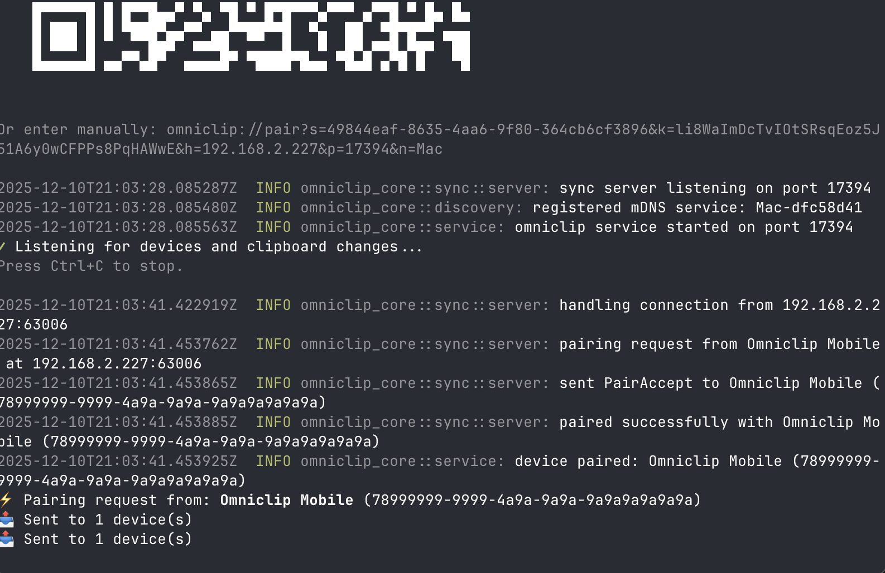
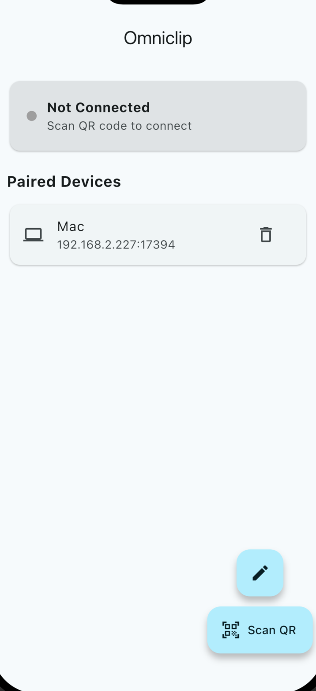

# Omniclip

Cross-platform clipboard sync over LAN. No cloud, no account, just encrypted peer-to-peer.

<p align="center">
  
</p>

<p align="center">
  
</p>

## Features

- **LAN-only** - your clipboard never leaves your network
- **End-to-end encrypted** - X25519 key exchange + AES-256-GCM
- **QR code pairing** - scan once, stay connected
- **Zero config** - mDNS auto-discovery

## Quick Start

```bash
# run the cli
cargo run --release

# scan the QR code with the ios app
```

## How it Works

1. CLI generates ephemeral keypair and displays QR code
2. Mobile scans QR, performs ECDH key exchange
3. Both derive shared session key via HKDF
4. Clipboard changes sync bidirectionally, encrypted

## Stack

| Component | Tech |
|-----------|------|
| Core | Rust |
| CLI | Rust + clap |
| iOS/Android | Flutter |
| Crypto | X25519, Ed25519, AES-GCM |
| Discovery | mDNS/Bonjour |

## Building

```bash
# rust cli
cargo build --release

# flutter app
cd mobile && flutter build ios
```

## License

Apache 2.0
